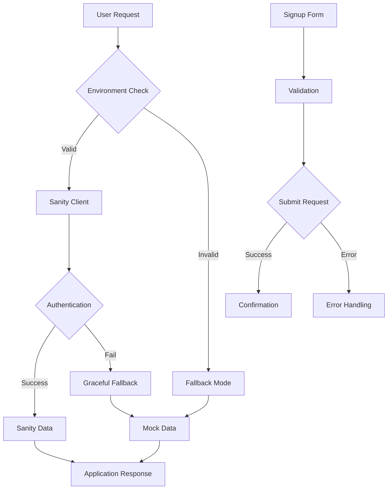

# Design Document

## Overview

The authentication system fix addresses critical failures in both the Sanity CMS integration and the user signup process. The current system has three main issues: (1) Sanity authentication failing with "Unauthorized - Session not found" errors, (2) JavaScript errors in the signup form preventing access request submissions, and (3) inconsistent environment variable configuration between client and server.

The solution involves fixing the Sanity client configuration, implementing proper error handling, ensuring environment variables are correctly set, and adding robust fallback mechanisms to prevent application crashes.

## Architecture

### Current System Analysis

The current system has several architectural issues:

1. **Sanity Client Configuration**: Multiple Sanity clients exist with inconsistent authentication setup
2. **Environment Variables**: Missing or inconsistent Sanity environment variables between different .env files
3. **Error Handling**: Insufficient error handling causing JavaScript exceptions to bubble up
4. **Authentication Flow**: Signup form errors prevent proper access request submission

### Proposed Architecture



## Components and Interfaces

### 1. Environment Configuration Manager

**Purpose**: Centralize and validate all environment variables

**Interface**:

```typescript
interface EnvironmentConfig {
  sanity: {
    projectId: string;
    dataset: string;
    apiVersion: string;
    token?: string;
  };
  supabase: {
    url: string;
    anonKey: string;
  };
}

class EnvironmentManager {
  static validateConfig(): EnvironmentConfig;
  static getConfig(): EnvironmentConfig;
  static isSanityConfigured(): boolean;
}
```

### 2. Enhanced Sanity Client

**Purpose**: Provide robust Sanity client with proper error handling and fallbacks

**Interface**:

```typescript
interface SanityClientConfig {
  projectId: string;
  dataset: string;
  apiVersion: string;
  token?: string;
  useCdn: boolean;
  timeout: number;
}

class EnhancedSanityClient {
  constructor(config: SanityClientConfig);
  async fetch<T>(query: string, params?: Record<string, any>): Promise<T>;
  async fetchWithFallback<T>(query: string, params?: Record<string, any>, fallback: T): Promise<T>;
  isConfigured(): boolean;
}
```

### 3. Authentication Error Handler

**Purpose**: Centralize error handling for authentication-related failures

**Interface**:

```typescript
interface AuthError {
  type: 'sanity' | 'supabase' | 'form';
  code: string;
  message: string;
  details?: any;
}

class AuthErrorHandler {
  static handleSanityError(error: any): AuthError;
  static handleSupabaseError(error: any): AuthError;
  static handleFormError(error: any): AuthError;
  static logError(error: AuthError): void;
}
```

### 4. Signup Form Manager

**Purpose**: Handle form submissions with proper error handling and validation

**Interface**:

```typescript
interface AccessRequestData {
  full_name: string;
  email: string;
  phone: string;
  department: string;
  justification: string;
}

class SignupFormManager {
  async submitRequest(data: AccessRequestData): Promise<{ success: boolean; error?: string }>;
  validateData(data: AccessRequestData): { valid: boolean; errors: string[] };
  async checkDuplicateEmail(email: string): Promise<boolean>;
}
```

## Data Models

### Environment Configuration

```typescript
interface SanityConfig {
  projectId: string;
  dataset: string;
  apiVersion: string;
  token?: string;
  configured: boolean;
}

interface SupabaseConfig {
  url: string;
  anonKey: string;
  configured: boolean;
}
```

### Error Models

```typescript
interface SanityAuthError {
  type: 'unauthorized' | 'timeout' | 'network' | 'configuration';
  originalError: any;
  timestamp: Date;
  query?: string;
  params?: Record<string, any>;
}

interface FormSubmissionError {
  field?: string;
  code: string;
  message: string;
  userMessage: string;
}
```

## Error Handling

### 1. Sanity Authentication Errors

**Strategy**: Graceful degradation with fallback data

```typescript
// Error handling flow:
1. Detect authentication failure
2. Log detailed error information
3. Return fallback/mock data
4. Display user-friendly message
5. Continue application flow
```

**Implementation**:

- Catch "Unauthorized - Session not found" errors
- Implement retry mechanism with exponential backoff
- Provide mock data when Sanity is unavailable
- Log errors for debugging without breaking UI

### 2. Form Submission Errors

**Strategy**: Comprehensive validation and user feedback

```typescript
// Error handling flow:
1. Validate form data client-side
2. Handle network errors gracefully
3. Provide specific error messages
4. Maintain form state on errors
5. Allow retry without data loss
```

**Implementation**:

- Wrap form submission in try-catch blocks
- Validate data before submission
- Handle Supabase connection errors
- Provide clear user feedback
- Implement retry mechanisms

### 3. Environment Configuration Errors

**Strategy**: Early detection and clear error messages

```typescript
// Error handling flow:
1. Validate environment variables on startup
2. Provide clear error messages for missing config
3. Gracefully handle partial configuration
4. Enable development mode fallbacks
```

## Testing Strategy

### 1. Unit Tests

**Sanity Client Tests**:

- Test client initialization with valid/invalid config
- Test query execution with various error scenarios
- Test fallback mechanisms
- Test timeout handling

**Form Manager Tests**:

- Test form validation with various input combinations
- Test submission with network failures
- Test duplicate email detection
- Test error message generation

**Environment Manager Tests**:

- Test configuration validation
- Test missing environment variable handling
- Test partial configuration scenarios

### 2. Integration Tests

**Authentication Flow Tests**:

- Test complete signup flow from form to database
- Test Sanity authentication with real credentials
- Test error scenarios end-to-end
- Test fallback data serving

**Error Handling Tests**:

- Test application behavior with Sanity unavailable
- Test form submission with Supabase unavailable
- Test mixed error scenarios
- Test recovery mechanisms

### 3. Environment Tests

**Configuration Tests**:

- Test with missing Sanity environment variables
- Test with invalid Sanity credentials
- Test with missing Supabase configuration
- Test development vs production configurations

### 4. User Experience Tests

**Error Message Tests**:

- Verify user-friendly error messages
- Test error message localization
- Test error recovery instructions
- Test form state preservation during errors

**Fallback Behavior Tests**:

- Test application usability with mock data
- Test graceful degradation scenarios
- Test performance with fallback mechanisms
- Test user notification of degraded functionality
