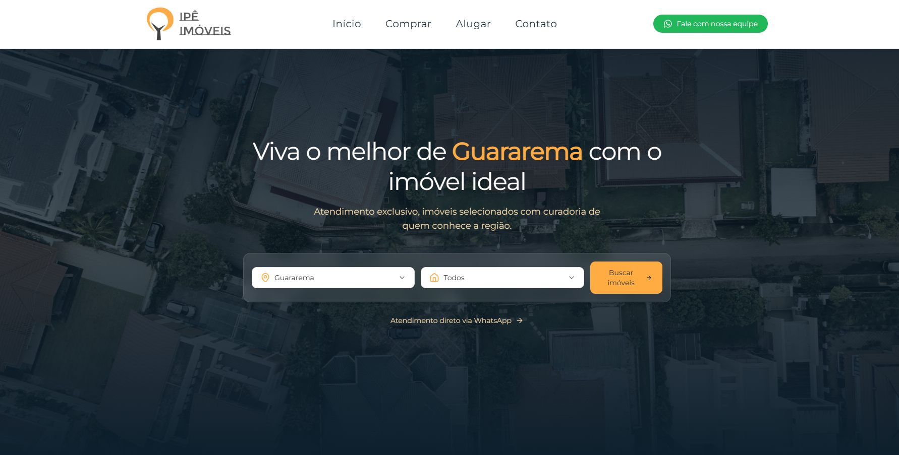

<h1 align="center">
  🌳 Nova Ipê Imóveis
</h1>

  <strong>Transformando a experiência imobiliária de Guararema-SP com tecnologia, design e performance.</strong>

  
  
  
  
  

---

## ✨ Visão Geral

O **Nova Ipê** é um projeto real de transformação digital de uma imobiliária tradicional. Foi criado para:

- Posicionar a **Ipê Imóveis** como autoridade online.
- Otimizar geração de leads qualificados.
- Oferecer uma experiência de navegação **moderna, responsiva e elegante**.
- Servir como **prova de conceito técnico e visual**.

> ⚡️ Totalmente desenvolvido em Next.js 14, Tailwind, TypeScript e Plasmic.

---

## 🎯 Principais Diferenciais

- ✅ Arquitetura moderna com **App Router do Next.js**
- ✅ UI refinada e customizada via **Plasmic Studio**
- ✅ Alta performance com **Vercel Hosting**
- ✅ Design modular e escalável
- ✅ Preparado para **SEO**, SSR e futuras automações

---

## 🔍 Preview

  

---

## 🧠 Tecnologias Utilizadas

| Tecnologia     | Função                                     |
|----------------|---------------------------------------------|
| **Next.js 14** | Framework base com App Router              |
| **TypeScript** | Tipagem estática para robustez             |
| **Tailwind CSS** | Estilização rápida e responsiva         |
| **[Em transição]**    | CMS visual para colaboração e design       |
| **Vercel**     | Deploy automatizado e CDN global           |
