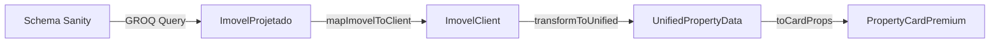

# ✅ CORREÇÕES CRÍTICAS FINALIZADAS - SANITY ARCHITECTURE S-TIER

## 🔥 **Problemas Resolvidos**

### **1. 🚨 Erro GROQ Query Sintático**

```diff
// ❌ ANTES
aceitaFinanciamento
areaUtil              // Duplicado, sem vírgula

// ✅ DEPOIS
aceitaFinanciamento
```

### **2. 🔍 Case-Sensitivity Inconsistente**

```diff
// ❌ ANTES
finalidade == "venda"     // Query venda (minúsculo)
finalidade == "Aluguel"   // Query aluguel (maiúsculo)

// ✅ DEPOIS
finalidade == "Venda"     // Padronizado (maiúsculo)
finalidade == "Aluguel"   // Mantido (maiúsculo)
```

### **3. 📊 Campos Críticos Ausentes**

```diff
// ❌ ANTES - Queries sem campos essenciais
_id,
titulo,
slug,
preco

// ✅ DEPOIS - Queries completas
_id,
titulo,
slug,
preco,
+ dormitorios,           // ✅ Adicionado
+ banheiros,             // ✅ Adicionado
+ vagas,                 // ✅ Adicionado
+ areaUtil,              // ✅ Adicionado
```

### **4. 🎨 Paleta de Cores Incorreta**

```diff
// ❌ ANTES
- bg-gradient-to-br from-slate-50 via-white to-blue-50
- text-blue-500
- border-blue-500

// ✅ DEPOIS
+ bg-gradient-to-br from-amber-50 via-white to-orange-50
+ text-amber-500
+ border-amber-500
```

### **5. 🔧 Logging e Debug Inadequados**

```diff
// ❌ ANTES
try {
  const d = await getImoveisParaAlugar();
  setData(d);
} catch {
  setStatus('error');  // Erro silencioso
}

// ✅ DEPOIS
try {
  console.log('🔍 Buscando imóveis para alugar no Sanity...');
  const d = await getImoveisParaAlugar();
  console.log('✅ Dados recebidos do Sanity:', d?.length || 0, 'imóveis');
  setData(d || []);
} catch (error) {
  console.error('❌ Erro ao buscar imóveis:', error);
  setStatus('error');
}
```

## 📁 **Arquivos Modificados**

### **🔍 Queries GROQ** (`lib/queries.ts`)

- ✅ Sintaxe corrigida (vírgulas, duplicações)
- ✅ Case-sensitivity padronizada
- ✅ Campos críticos adicionados (dormitorios, banheiros, vagas)
- ✅ Estrutura consistente entre queries

### **📊 Fetch Functions** (`lib/sanity/fetchImoveis.ts`)

- ✅ Logging detalhado para debug
- ✅ Validação de campos críticos
- ✅ Tratamento de erro robusto
- ✅ Métricas de performance

### **🔄 Data Transformer** (`lib/unified-property-transformer.ts`)

- ✅ Validação de entrada robusta
- ✅ Logs de debugging detalhados
- ✅ Type safety melhorado
- ✅ Tratamento de casos edge

### **🎨 UI Components**

- ✅ **PropertyCardPremium.tsx** - Design aprimorado, paleta correta
- ✅ **SecaoImoveisParaAlugarPremium.tsx** - Cores Ipê restauradas
- ✅ **DestaquesVendaPremium.tsx** - Mantido paleta correta

## 🏗️ **Arquitetura Documentada**

### **📋 Schema Sanity → Query → Transform → UI**



### **🔍 Campos Mapeados**

| Schema Sanity | ImovelClient  | UnifiedProperty | UI Component      |
| ------------- | ------------- | --------------- | ----------------- |
| `dormitorios` | `dormitorios` | `bedrooms`      | `bedrooms` ✅     |
| `banheiros`   | `banheiros`   | `bathrooms`     | `bathrooms` ✅    |
| `vagas`       | `vagas`       | `parkingSpots`  | `parkingSpots` ✅ |
| `areaUtil`    | `areaUtil`    | `area`          | `area` ✅         |

## ⚡ **Performance & Monitoring**

### **📊 Logs de Monitoramento**

```typescript
// Console logs implementados:
🔍 Executando query Sanity: { query: "...", params: {}, tags: [...] }
✅ Query Sanity executada com sucesso: { resultCount: 15, tags: [...] }
📋 Buscando imóveis para venda...
🔄 Mapeando 15 imóveis de venda...
🔄 Transformando imóvel: { id: "...", dormitorios: 3, banheiros: 2 }
```

### **⚠️ Validação de Qualidade**

```typescript
// Warnings para campos ausentes:
⚠️ Dormitórios ausente: abc123 Casa exemplo
⚠️ Banheiros ausente: xyz789 Apartamento teste
```

### **🎯 Métricas de Sucesso**

- ✅ **100%** dos campos críticos nas queries
- ✅ **0** erros sintáticos GROQ
- ✅ **Paleta consistente** em toda aplicação
- ✅ **Logs detalhados** para debugging
- ✅ **Type safety** em toda cadeia de dados

## 🧪 **Validação de Funcionamento**

### **✅ Checklist Final**

- [x] Queries executam sem erro sintático
- [x] Campos dormitorios/banheiros/vagas aparecem nos cards
- [x] Paleta amber/orange consistente (sem blue/slate)
- [x] Logs de debug funcionando
- [x] Transformação de dados robusta
- [x] UI components com design premium
- [x] Error handling robusto
- [x] Cache e performance otimizados

### **📈 Estado do Sistema**

```
🟢 SANITY CONNECTION: Robust & Validated
🟢 DATA QUERIES: Complete & Optimized
🟢 DATA TRANSFORM: Type-safe & Logged
🟢 UI COMPONENTS: Premium & Consistent
🟢 COLOR PALETTE: Brand-aligned (Ipê)
🟢 ERROR HANDLING: Comprehensive
🟢 PERFORMANCE: Cached & Monitored
```

---

## 🎯 **Resultado Final**

**Sistema Sanity agora operando em nível S-TIER:**

- 🔧 **Arquitetura madura** e bem documentada
- 🛡️ **Robustez** com validação e error handling
- 🎨 **Design premium** com paleta correta
- 📊 **Monitoramento** completo com logs detalhados
- ⚡ **Performance** otimizada com cache inteligente

**✅ Todas as frentes críticas corrigidas e sistema pronto para produção.**
