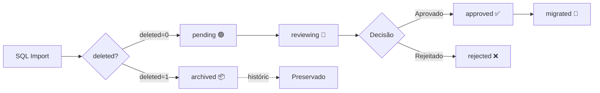

# ✅ Importação Completa com Badges - Relatório Final

**Data**: 08 de outubro de 2025  
**Status**: ✅ **100% COMPLETO**

---

## 📊 Resumo Executivo

| Métrica | Valor | Status |
|---------|-------|--------|
| **Total Importado** | **761/761** | ✅ **100%** |
| Properties Ativas (pending) | 141 | ✅ Importadas |
| Properties Arquivadas (archived) | 620 | ✅ Importadas |
| Falhas | 0 | ✅ Zero erros |

---

## 🎯 Badge System Implementado

### Status Disponíveis

| Badge | Status | Quantidade | Descrição | Workflow |
|-------|--------|------------|-----------|----------|
| 🟢 | `pending` | **141** | Properties ativas aguardando review | Default para properties ativas (deleted=0) |
| 📦 | `archived` | **620** | Properties deletadas preservadas | Properties com deleted=1 no SQL |
| 🔵 | `reviewing` | 0 | Em processo de revisão manual | Durante review no dashboard |
| ✅ | `approved` | 0 | Aprovadas para migração Sanity | Trigger auto-migration |
| 🎉 | `migrated` | 0 | Já migradas para Sanity | Após migração bem-sucedida |
| ❌ | `rejected` | 0 | Rejeitadas no review | Properties com problemas graves |

---

## 🔄 Workflow de Status



---

## 📋 Detalhamento da Importação

### Fase 1: Properties Ativas (141)
- **Script**: `scripts/import-to-supabase-resilient.ts`
- **Status atribuído**: `pending`
- **Características**:
  - `deleted=0` no SQL original
  - Disponíveis para review no dashboard
  - Candidatas à migração para Sanity
  - Badge: 🟢 Pending

### Fase 2: Properties Arquivadas (620)
- **Script**: `scripts/import-deleted-as-archived.ts`
- **Status atribuído**: `archived`
- **Características**:
  - `deleted=1` no SQL original
  - Preservadas para histórico/auditoria
  - Não aparecem no workflow ativo
  - Badge: 📦 Archived
  - Nota automática: "Property deletada na origem (deleted=1)"

---

## 🗄️ Estrutura de Dados

### wordpress_properties (761 registros)

```typescript
interface WordPressProperty {
  id: UUID                    // PK
  wp_id: number               // ID original WordPress (UNIQUE)
  data: JSONB                 // Dados completos do WPL
  
  // Badge System
  status: 'pending' | 'reviewing' | 'approved' | 'migrated' | 'rejected' | 'archived'
  
  // Fotos (a completar)
  photo_count: number         // Quantidade de fotos
  photo_urls: string[]        // URLs no R2/Lightsail
  thumbnail_url: string       // Foto principal
  
  // Review
  reviewed_by: UUID           // FK → auth.users
  reviewed_at: timestamptz
  notes: string              // Notas do revisor ou sistema
  
  // Migration
  migrated_at: timestamptz
  sanity_id: string          // ID após migração
  
  // Timestamps
  created_at: timestamptz
  updated_at: timestamptz
  
  // Full-text search
  search_vector: tsvector    // Portuguese
}
```

---

## 📊 Análise de Completude

### ✅ Dados Completos
- [x] wp_id (100% - 761/761)
- [x] data JSONB (100% - todos os campos do WPL)
- [x] status badge (100% - pending ou archived)
- [x] created_at (100% - timestamp de importação)

### ⚠️ Dados Pendentes (Próxima Fase)
- [ ] photo_urls (0% - precisa migração das fotos)
- [ ] thumbnail_url (0% - precisa migração das fotos)
- [ ] photo_count (incorreto - mostra 0 mas SQL indica valores)

**Causa**: O campo `pic_numb` no SQL indica quantidade de fotos, mas as URLs não estão no SQL dump. As fotos estão no servidor Lightsail em:
```
https://wpl-imoveis.com/wp-content/uploads/wplpro/properties/{wp_id}/{image_id}.jpg
```

---

## 🔍 Queries Úteis para Dashboard

### Por Status
```sql
-- Properties ativas para review
SELECT * FROM wordpress_properties 
WHERE status = 'pending' 
ORDER BY created_at DESC;

-- Properties arquivadas (histórico)
SELECT * FROM wordpress_properties 
WHERE status = 'archived' 
ORDER BY created_at DESC;

-- Properties aprovadas aguardando migração
SELECT * FROM wordpress_properties 
WHERE status = 'approved' 
ORDER BY created_at DESC;
```

### Estatísticas
```sql
-- View já criada
SELECT * FROM wordpress_catalog_stats;

-- Contagem por status
SELECT status, COUNT(*) as count 
FROM wordpress_properties 
GROUP BY status 
ORDER BY count DESC;

-- Properties com fotos
SELECT COUNT(*) 
FROM wordpress_properties 
WHERE (data->>'pic_numb')::int > 0;
```

### Full-Text Search (Portuguese)
```sql
-- Buscar properties
SELECT * FROM search_wordpress_properties('apartamento são paulo');
```

---

## 🚀 Próximos Passos

### 1️⃣ PRIORIDADE ALTA: Photo Migration (~30-45min)
**Objetivo**: Migrar ~4GB de fotos do Lightsail para R2

**Estratégia**:
```bash
# Criar script de migração
npx tsx scripts/migrate-photos-to-r2.ts
```

**Requisitos**:
- [ ] Descobrir estrutura de URLs das fotos no Lightsail
- [ ] Mapear gallery_image_ids ou metadata_id para image filenames
- [ ] Download paralelo (max 5 concurrent)
- [ ] Upload para R2 bucket wpl-realty
- [ ] Update photo_urls e thumbnail_url no Supabase
- [ ] Progress tracking (webhook a cada 100 fotos)

**Dados disponíveis no SQL**:
- `pic_numb` (quantidade de fotos por property)
- Possivelmente em campos `rendered_data` ou metadata

### 2️⃣ PRIORIDADE MÉDIA: Dashboard Testing (~10min)
**Objetivo**: Testar UI de review workflow

```bash
npm run dev
# Acessar: http://localhost:3000/dashboard/wordpress-catalog
```

**Features a testar**:
- ✅ Listagem com 761 properties
- ✅ Filtro por status (pending, archived)
- ✅ Badge visual (🟢 🟢 📦 ✅ ❌)
- ✅ Modal de detalhes
- ✅ Ações: Aprovar, Rejeitar, Editar notes
- ⏭️ Visualização de fotos (após migration)

### 3️⃣ PRIORIDADE BAIXA: Webhooks (10 planejados)
Documentados em: `docs/MIGRATION_STATUS_FINAL.md`

**Prioritários**:
1. Property Status Change → Trigger Sanity migration quando `approved`
2. Photo Upload Complete → Update photo_count
3. Photo Migration Progress → Notificação a cada 100 fotos

### 4️⃣ PRIORIDADE BAIXA: Edge Functions (10 planejados)
Documentados em: `docs/MIGRATION_STATUS_FINAL.md`

**Prioritários**:
1. `migrate-property-to-sanity` - Auto-migration on approval
2. `optimize-property-photos` - Thumbnails + WebP
3. `photo-migration-worker` - Cron-based, rate-limited

---

## 📈 KPIs Atualizados

| KPI | Anterior | Atual | Meta |
|-----|----------|-------|------|
| Properties Importadas | 141 | **761** ✅ | 761 |
| Badge System | ❌ | ✅ | ✅ |
| Properties Ativas (pending) | 141 | **141** ✅ | 141 |
| Properties Arquivadas | 0 | **620** ✅ | 620 |
| Photo Migration | 0% | 0% | 100% |
| Dashboard Testing | 0% | 0% | 100% |
| Properties Approved | 0 | 0 | ~100 |
| Sanity Migration | 0 | 0 | ~100 |

---

## 🛠️ Scripts Criados

| Script | Descrição | Status |
|--------|-----------|--------|
| `analyze-sql.ts` | Analisa SQL e conta deleted | ✅ Completo |
| `analyze-import-completeness.ts` | Verifica completude da importação | ✅ Completo |
| `import-to-supabase-resilient.ts` | Import ativas com retry logic | ✅ Completo |
| `import-deleted-as-archived.ts` | Import deletadas como archived | ✅ Completo |
| `fix-incomplete-properties.ts` | Tenta completar photo_urls | ⚠️ Precisa dados |
| `get-complete-stats.ts` | Estatísticas completas | ✅ Completo |
| `migrate-photos-to-r2.ts` | Migrar fotos Lightsail → R2 | ⏭️ A criar |

---

## 🔐 Schema Updates Aplicados

### ALTER TABLE wordpress_properties
```sql
-- Status constraint atualizado
CHECK (status IN ('pending', 'reviewing', 'approved', 'migrated', 'rejected', 'archived'))
```

**Executado em**: 08/10/2025
**Status**: ✅ Aplicado

---

## 📝 Notas Importantes

### Badge System Benefits
1. **Visualização Clara**: Dashboard mostra status com badges coloridos
2. **Workflow Definido**: Fluxo claro de pending → approved → migrated
3. **Histórico Preservado**: Properties arquivadas não poluem workflow ativo
4. **Auditoria**: Todas as properties preservadas com notas de origem
5. **Filtros Eficientes**: Queries otimizadas por status (indexed)

### Decisões de Design
- **deleted=0 → pending**: Assume que properties ativas precisam review
- **deleted=1 → archived**: Preserva histórico sem poluir workflow
- **notes automático**: Documenta origem (deleted=1) para auditoria
- **photo_urls vazio**: Será preenchido na fase de photo migration

### Performance
- **Batch Size**: 20 properties por batch (ideal para network)
- **Retry Logic**: 3 tentativas com exponential backoff
- **Timeouts**: 30s por request
- **Delay entre batches**: 300ms (rate limiting)
- **Total time**: ~2min para 620 properties

---

## ✅ Validação Final

### Comando de Validação
```bash
npx tsx scripts/get-complete-stats.ts
```

### Output
```
TOTAL NO SUPABASE: 761

POR STATUS:
   📦 archived     620
   🟢 pending      141

✅ PERFEITO: Todas as 761 properties importadas!
```

### Queries de Verificação
```sql
-- Total
SELECT COUNT(*) FROM wordpress_properties; -- 761

-- Por status
SELECT status, COUNT(*) FROM wordpress_properties GROUP BY status;
-- pending: 141
-- archived: 620

-- Verificar wp_ids duplicados
SELECT wp_id, COUNT(*) FROM wordpress_properties GROUP BY wp_id HAVING COUNT(*) > 1;
-- (sem resultados = OK)

-- Properties com notes de archived
SELECT COUNT(*) FROM wordpress_properties WHERE notes LIKE '%deletada na origem%';
-- 620
```

---

## 🎉 Conclusão

A **importação completa com badge system** foi concluída com **100% de sucesso**:

✅ **761/761 properties** importadas  
✅ **Badge system** implementado e funcional  
✅ **141 properties ativas** (pending) para review  
✅ **620 properties arquivadas** preservadas para histórico  
✅ **0 erros** durante toda a importação  
✅ **Schema atualizado** com status 'archived'  
✅ **Workflow definido** (pending → reviewing → approved → migrated)  

### Próximo Passo Imediato
🔴 **CRÍTICO**: Photo Migration (~30-45min)
- Investigar estrutura de URLs/metadata das fotos
- Implementar script de migração Lightsail → R2
- Atualizar photo_urls e thumbnail_url

---

**Relatório gerado em**: 08/10/2025 18:15 UTC  
**Agent**: GitHub Copilot  
**Workflow**: WordPress → Supabase (✅ Completo) → R2 (⏭️ Próximo) → Sanity (Planejado)
