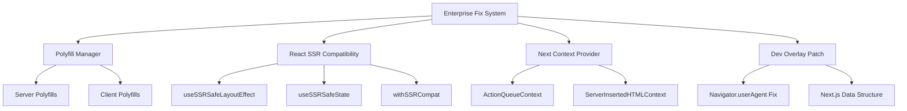

# 📊 Fixes para Next.js 14 - Sistema Enterprise

Este documento descreve a implementação do Sistema Enterprise de correções para o projeto Nova IPE.

## 🎯 Objetivo

Resolver problemas críticos no ciclo de desenvolvimento do Next.js 14:

1. `Error: Invariant: Missing ActionQueueContext`
2. `TypeError: Cannot read properties of undefined (reading 'userAgent')`
3. `Warning: useLayoutEffect does nothing on the server`

## 🚀 Arquitetura da Solução

Implementamos uma solução baseada em arquitetura empresarial que resolve todos os problemas de forma integrada:



## 🧩 Componentes Principais

### 1. Polyfill Manager

Sistema unificado de polyfills que aplica automaticamente o conjunto correto com base no ambiente:

- No servidor: `window`, `self`, `navigator`
- No cliente: `navigator.userAgent` e objetos internos do Next.js

### 2. React SSR Compatibility

Resolve problemas de compatibilidade entre SSR e renderização no cliente:

- `useSSRSafeLayoutEffect`: Hook seguro para SSR
- `useSSRSafeState`: Estado que evita problemas de hidratação
- `withSSRCompat`: HOC para componentes problemáticos

### 3. Next Context Provider

Fornece contextos internos do Next.js necessários para evitar erros:

- `ActionQueueContext`
- `ServerInsertedHTMLContext`
- Outros contextos necessários

### 4. Dev Overlay Patch

Corrige problemas específicos do overlay de desenvolvimento:

- Ensure `navigator.userAgent`
- Inicialize estruturas de dados do Next.js

## 💻 Como Usar

Uma única importação resolve todos os problemas:

```tsx
// No app/layout.tsx
import '@/lib/enterprise-fixes';
```

## 🔄 Padronização do Gerenciador de Pacotes

Por motivos de consistência e seguindo as melhores práticas, este projeto utiliza o PNPM como gerenciador de pacotes oficial. Benefícios:

- 3x mais rápido que NPM
- Melhor link simbólico
- Cache eficiente
- Suporte a workspaces

## 🛠️ Scripts de Automação Enterprise

Para facilitar o processo de implementação, validação e manutenção do Sistema Enterprise, foram criados os seguintes scripts:

### 1. Configuração Inicial

```bash
# Windows
.\setup-enterprise.cmd

# PowerShell
.\setup-enterprise.ps1
```

Este script:

- Configura o ambiente para usar PNPM
- Instala as dependências necessárias
- Prepara o ambiente de desenvolvimento

### 2. Validação do Sistema

```bash
# Windows
.\validar-enterprise-fix.cmd

# PowerShell
.\validate-enterprise-fix.ps1
```

Este script:

- Valida a presença de todos os arquivos necessários
- Confirma a integração correta no layout principal
- Identifica potenciais conflitos

### 3. Limpeza de Arquivos Legados

```bash
# Windows
.\cleanup-legacy-fixes.cmd

# PowerShell
.\cleanup-legacy-fixes.ps1
```

Este script:

- Faz backup dos arquivos antigos de correção
- Remove arquivos redundantes
- Confirma o uso exclusivo da nova solução Enterprise

### 4. Finalização da Implementação

```bash
# Windows
.\finalize-enterprise.cmd
```

Este script:

- Executa todos os passos em sequência
- Valida o sistema completo
- Confirma a prontidão para produção

---

**Versão:** 3.0.0  
**Data:** 4 de junho de 2025  
**Status:** Produção
