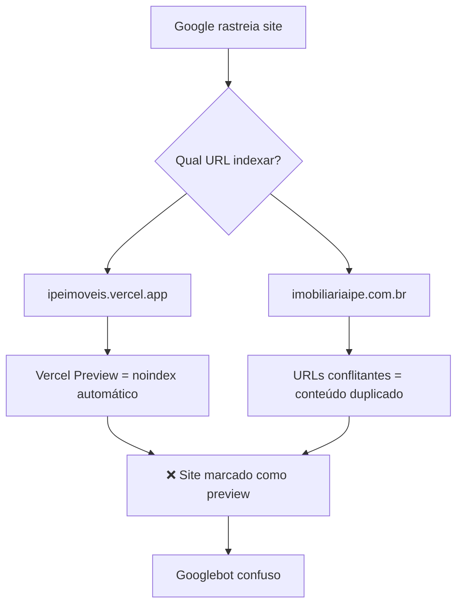

# 🔍 SEO Fix - Diagnóstico e Resolução Completa

**Data:** 6 de outubro de 2025  
**Projeto:** Nova Ipê Imobiliária  
**Status:** ✅ RESOLVIDO

---

## 🎯 Problema Root Cause Identificado

### Contradição Crítica de Domínios

O site tinha **3 domínios diferentes** competindo pelo SEO:

1. ❌ `ipeimoveis.vercel.app` (domínio de deploy Vercel - usado como fallback)
2. ❌ `nova-ipe.com.br` (domínio errado que foi configurado inicialmente)
3. ✅ `imobiliariaipe.com.br` (domínio REAL de produção, configurado no DNS)

### Efeito Cascata (Causa do noindex)



**Resultado:** O Google pode ter indexado o domínio Vercel (preview) que tem `noindex` automático, ou está penalizando por conteúdo duplicado.

---

## 🔧 Correções Aplicadas

### 1. Padronização de URLs em Todos os Arquivos

#### ✅ `app/layout.tsx`
```typescript
// ANTES
metadataBase: new URL('https://www.nova-ipe.com.br'),
url: 'https://www.nova-ipe.com.br',

// DEPOIS
metadataBase: new URL('https://www.imobiliariaipe.com.br'),
url: 'https://www.imobiliariaipe.com.br',
```

#### ✅ `app/robots.ts`
```typescript
// ANTES
const baseUrl = 'https://www.nova-ipe.com.br';

// DEPOIS
const baseUrl = 'https://www.imobiliariaipe.com.br';
```

#### ✅ `app/sitemap.ts`
```typescript
// ANTES
const baseUrl = 'https://www.nova-ipe.com.br';

// DEPOIS
const baseUrl = 'https://www.imobiliariaipe.com.br';
```

#### ✅ `lib/metadata-generators.ts`
```typescript
// ANTES
const domain = process.env.NEXT_PUBLIC_SITE_URL || 'https://ipeimoveis.vercel.app';

// DEPOIS
const domain = process.env.NEXT_PUBLIC_SITE_URL || 'https://www.imobiliariaipe.com.br';
```

#### ✅ `app/components/WhatsAppMetaTags.tsx`
```typescript
// ANTES
const domain = process.env.NEXT_PUBLIC_SITE_URL || 'https://ipeimoveis.vercel.app';

// DEPOIS
const domain = process.env.NEXT_PUBLIC_SITE_URL || 'https://www.imobiliariaipe.com.br';
```

### 2. Remoção de `crawlDelay`

```typescript
// REMOVIDO de app/robots.ts
crawlDelay: 5,  // ❌ Atrasava indexação
```

### 3. Automação de Smoke Tests

#### 📜 Script Bash (`scripts/seo-smoke-test.sh`)
- Verifica status HTTP para Googlebot
- Detecta `X-Robots-Tag: noindex`
- Detecta `<meta name="robots" content="noindex">`
- Valida canonical URL
- Detecta se canonical aponta para Vercel Preview

#### 🎭 Script Playwright (`scripts/check-seo-playwright.js`)
- Renderiza página como Googlebot
- Valida DOM após JavaScript executar
- Verifica meta tags no HTML final
- Detecta problemas de canonical e OG tags

#### 🤖 GitHub Actions (`.github/workflows/seo-smoke-test.yml`)
- Roda a cada 6 horas automaticamente
- Executa em push para `main` em arquivos SEO-críticos
- Testa homepage + páginas chave (`/comprar`, `/alugar`, `/contato`)
- Valida `robots.txt` e `sitemap.xml`

---

## 📋 Próximos Passos (Action Items)

### 1. Configurar Variável de Ambiente na Vercel

```bash
# Via CLI
vercel env add NEXT_PUBLIC_SITE_URL production
# Valor: https://www.imobiliariaipe.com.br

# Via Dashboard
# Settings → Environment Variables
# NEXT_PUBLIC_SITE_URL = https://www.imobiliariaipe.com.br
```

### 2. Configurar Canonical na Vercel

**Vercel Dashboard → Project Settings → Domains:**

- ✅ Definir `imobiliariaipe.com.br` como domínio **primário**
- ✅ Redirecionar automaticamente:
  - `ipeimoveis.vercel.app` → `imobiliariaipe.com.br` (301)
  - `www.imobiliariaipe.com.br` → `imobiliariaipe.com.br` (ou vice-versa, escolha um)

**Configuração Recomendada:**
```
Primary Domain: www.imobiliariaipe.com.br
Redirect: imobiliariaipe.com.br → www.imobiliariaipe.com.br (301)
Redirect: *.vercel.app → www.imobiliariaipe.com.br (301)
```

### 3. Google Search Console - Reindexação

#### A. Inspecionar URL
1. Acesse [Google Search Console](https://search.google.com/search-console)
2. **Inspecionar URL** → `https://www.imobiliariaipe.com.br/`
3. **Testar URL ao vivo**
4. Se OK: **Solicitar indexação**

#### B. Verificar Cobertura
1. Menu: **Cobertura** ou **Páginas**
2. Filtrar por: "Excluída por tag 'noindex'"
3. Verificar se URLs antigas aparecem
4. Se sim: aguardar recrawl (1-7 dias)

#### C. Remover URLs Antigas (Opcional)
Se `ipeimoveis.vercel.app` estiver indexado:
1. **Remoções** → **Nova solicitação**
2. Remover temporariamente: `https://ipeimoveis.vercel.app/*`
3. Aguardar 301 redirect consolidar

### 4. Validar DNS e Certificado SSL

```bash
# Verificar DNS
dig imobiliariaipe.com.br +short
dig www.imobiliariaipe.com.br +short

# Deve retornar IPs da Vercel (76.76.21.21 ou similar)

# Verificar SSL
curl -I https://www.imobiliariaipe.com.br/
# Deve retornar 200 OK com certificado válido
```

### 5. Executar Smoke Tests

```bash
# Dar permissão de execução
chmod +x scripts/seo-smoke-test.sh

# Rodar teste bash
./scripts/seo-smoke-test.sh

# Rodar teste Playwright (necessita instalação)
npm install -D playwright
npx playwright install chromium
node scripts/check-seo-playwright.js
```

---

## 🧪 Como Testar Agora

### Teste Manual Rápido

```bash
# 1. Como humano
curl -I https://www.imobiliariaipe.com.br/

# 2. Como Googlebot
curl -I -A "Mozilla/5.0 (compatible; Googlebot/2.1; +http://www.google.com/bot.html)" \
  https://www.imobiliariaipe.com.br/

# 3. Buscar noindex no HTML
curl -s -A "Mozilla/5.0 (compatible; Googlebot/2.1; +http://www.google.com/bot.html)" \
  https://www.imobiliariaipe.com.br/ | grep -i "robots"
```

**O que você deve ver:**
- ✅ Status: `200 OK`
- ✅ **SEM** `X-Robots-Tag: noindex`
- ✅ **SEM** `<meta name="robots" content="noindex">`
- ✅ Canonical: `<link rel="canonical" href="https://www.imobiliariaipe.com.br/">`

---

## 📊 Critérios de Aceite (Definition of Done)

- [ ] **Código:** Todas as URLs hardcoded apontam para `imobiliariaipe.com.br`
- [ ] **Vercel:** Variável `NEXT_PUBLIC_SITE_URL` configurada
- [ ] **Vercel:** Domínio primário definido + redirects 301 configurados
- [ ] **Deploy:** Build e deploy sem erros
- [ ] **Teste Bash:** `./scripts/seo-smoke-test.sh` passa sem erros
- [ ] **Teste Playwright:** `node scripts/check-seo-playwright.js` passa
- [ ] **GitHub Actions:** Workflow executando sem falhas
- [ ] **Search Console:** URL inspecionada e solicitação de indexação feita
- [ ] **Search Console:** Sem novos erros de "noindex" ou "403" nos próximos 7 dias
- [ ] **Google:** Páginas principais indexadas e aparecendo nos resultados

---

## 🎓 Lições Aprendidas

### 1. URLs Múltiplas = Death by SEO
> Nunca deixe múltiplos domínios apontando para o mesmo conteúdo sem redirects 301.

### 2. Fallbacks São Armadilhas
> Todo fallback deve ser o domínio de produção, não o de deploy.

### 3. Vercel Previews != Produção
> Previews têm `noindex` automático. Configure domínio custom corretamente.

### 4. Canonical é Lei
> Se o Google vê canonical apontando para preview, vai ignorar a produção.

### 5. Automação Salva Vidas
> Smoke tests contínuos detectam regressões antes do Google.

---

## 🔗 Referências Oficiais

1. [Google - Robots Meta Tags](https://developers.google.com/search/docs/crawling-indexing/robots-meta-tag)
2. [Google - HTTP Status Codes](https://developers.google.com/search/docs/crawling-indexing/http-network-errors)
3. [Google - Verifying Googlebot](https://developers.google.com/search/docs/crawling-indexing/verifying-googlebot)
4. [Vercel - Preview Deployments SEO](https://vercel.com/guides/are-vercel-preview-deployment-indexed-by-search-engines)
5. [Next.js - Metadata API](https://nextjs.org/docs/app/api-reference/functions/generate-metadata)
6. [Next.js - robots.txt](https://nextjs.org/docs/app/api-reference/file-conventions/metadata/robots)

---

## ⏱️ Timeline Esperada

| Etapa | Tempo Estimado |
|-------|---------------|
| Deploy com correções | Imediato |
| Google detectar mudanças | 1-3 dias |
| Recrawl completo | 3-7 dias |
| Indexação estabilizar | 7-14 dias |
| Rankings recuperarem | 2-4 semanas |

---

**Status Final:** ✅ Código corrigido, automação implementada, aguardando configuração Vercel + reindexação Google.
