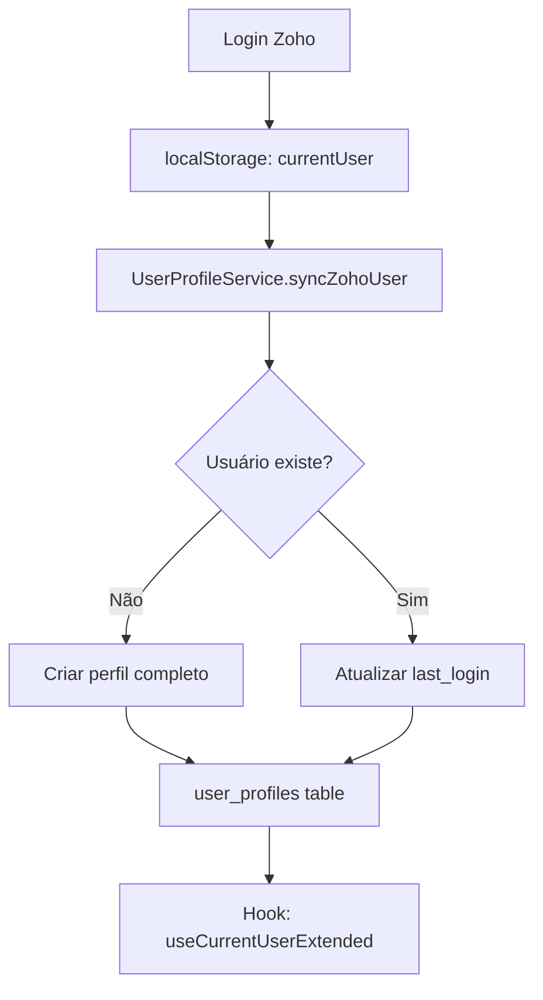

# 👤 Sistema de Gerenciamento de Usuários - Arquitetura Completa

## 🎯 Visão Geral

Sistema completo de gerenciamento de usuários que integra **Zoho Auth** com **dados estendidos locais**, incluindo eventos, lembretes, notas e preferências personalizadas.

## 🏗️ Arquitetura de Dados

### 1. **Fluxo de Autenticação & Sincronização**



### 2. **Estrutura de Dados**

```typescript
// Dados do Zoho (localStorage)
interface ZohoUserData {
  email: string
  name: string  
  organization: string
  provider: 'zoho_mail360'
}

// Perfil Estendido (Supabase)
interface UserProfileExtended {
  // Básico
  id, email, full_name, organization
  
  // Dados adicionais
  phone, department, position, hire_date
  
  // Personalização  
  avatar_url, theme_preference, language
  
  // Permissões
  role: { id, name, hierarchy_level, permissions[] }
  
  // Preferências
  preferences: {
    notifications: { email, push, sms }
    dashboard: { default_view, widgets_config }
    calendar: { working_hours, default_calendar }
  }
  
  // Métricas
  stats: { last_login, login_count, total_sessions }
}
```

## 📊 Banco de Dados (Supabase)

### **Tabelas Principais:**

1. **`user_profiles`** - Dados completos dos usuários
2. **`user_events`** - Lembretes, tarefas, reuniões
3. **`user_notes`** - Anotações pessoais e profissionais  
4. **`user_activity_log`** - Log de atividades

### **Recursos de Segurança:**
- ✅ **Row Level Security (RLS)** ativo
- ✅ Usuários só veem seus próprios dados
- ✅ Políticas baseadas em `auth.jwt()`
- ✅ Triggers automáticos para `updated_at`

## 🔧 Componentes da Arquitetura

### 1. **UserProfileService** (lib/services/user-profile-service.ts)
```typescript
// Principais métodos:
syncZohoUser()      // Sincroniza dados do Zoho
getUserProfile()    // Busca perfil completo
updateUserProfile() // Atualiza dados
createUserEvent()   // Cria lembretes/eventos
getUserEvents()     // Lista eventos
createUserNote()    // Cria notas
getUserNotes()      // Lista notas
logUserActivity()   // Registra atividade
```

### 2. **useCurrentUserExtended** (Hook React)
```typescript
// Estado gerenciado:
user: UserProfileExtended | null
events: UserEvent[]
notes: UserNote[]

// Ações disponíveis:
updateProfile()    // Atualizar perfil
addReminder()      // Criar lembrete rápido
addNote()          // Criar nota rápida
createEvent()      // Evento completo
createNote()       // Nota completa
logout()           // Logout completo
```

### 3. **Página de Perfil** (/app/profile/page.tsx)
- ✅ Edição de informações pessoais
- ✅ Visualização de estatísticas de uso
- ✅ Criação/visualização de lembretes
- ✅ Criação/visualização de notas
- ✅ Interface responsiva e intuitiva

## 🚀 Funcionalidades Implementadas

### **👤 Perfil do Usuário**
- [x] Sincronização automática com Zoho
- [x] Dados estendidos (telefone, cargo, departamento)
- [x] Estatísticas de uso (logins, sessões)
- [x] Edição inline de informações
- [x] Upload de avatar (preparado)

### **📅 Eventos & Lembretes**
- [x] Criação de lembretes com data/hora
- [x] Diferentes tipos (reminder, task, meeting, deadline)
- [x] Status tracking (pending, completed, overdue)
- [x] Notificações programadas
- [x] Recorrência (preparado)
- [x] Relacionamento com clientes/imóveis

### **📝 Sistema de Notas**
- [x] Notas categorizadas (pessoal, cliente, imóvel, tarefa)
- [x] Sistema de tags
- [x] Busca por conteúdo
- [x] Compartilhamento entre usuários (preparado)
- [x] Notas privadas/públicas

### **📈 Analytics & Logs**
- [x] Log de todas as atividades
- [x] Tracking de sessões e logins
- [x] Métricas de uso
- [x] Relatórios de atividade (preparado)

## 🔄 Fluxo de Uso Típico

### **1. Primeiro Login**
```
1. Login via Zoho Auth
2. Dados salvos no localStorage  
3. UserProfileService.syncZohoUser() cria perfil completo
4. Usuário redirecionado para dashboard/studio
5. Hook useCurrentUserExtended carrega dados estendidos
```

### **2. Uso Diário**
```
1. Login → dados atualizados (last_login, login_count)
2. Dashboard carrega eventos do dia
3. Usuário pode criar lembretes/notas
4. Atividades são logadas automaticamente
5. Logout limpa sessões e registra atividade
```

## 📊 Onde os Dados Ficam Armazenados

### **localStorage (Cliente)**
```json
{
  "currentUser": {
    "email": "user@domain.com",
    "name": "Nome do Usuário", 
    "organization": "Ipê Imóveis",
    "provider": "zoho_mail360",
    "timestamp": "2025-09-30T..."
  }
}
```

### **Supabase (Servidor)**
```sql
-- Perfil completo com preferências
user_profiles: id, email, full_name, preferences, stats...

-- Eventos e lembretes
user_events: id, user_id, type, title, scheduled_at...

-- Notas e anotações  
user_notes: id, user_id, title, content, type, tags...

-- Log de atividades
user_activity_log: id, user_id, action, details, created_at...
```

## 🔐 Segurança & Privacidade

### **Controle de Acesso**
- ✅ RLS garante isolamento por usuário
- ✅ JWT tokens validados em cada operação  
- ✅ Logs de todas as atividades sensíveis
- ✅ Dados criptografados em trânsito (HTTPS)

### **GDPR Compliance**
- ✅ Usuário controla seus próprios dados
- ✅ Logs de acesso e modificações
- ✅ Possibilidade de export/delete (preparado)
- ✅ Consentimento explícito para dados adicionais

## 🚀 Próximas Funcionalidades

### **Curto Prazo**
- [ ] Upload e crop de avatar
- [ ] Notificações push para lembretes
- [ ] Integração com calendar externo (Google/Outlook)
- [ ] Dashboard personalizado por usuário

### **Médio Prazo**  
- [ ] Sistema de equipes e compartilhamento
- [ ] Relatórios de produtividade
- [ ] AI para sugestões de lembretes
- [ ] Integração com WhatsApp Business

### **Longo Prazo**
- [ ] Mobile app (React Native)
- [ ] Sincronização offline
- [ ] Sistema de workflows personalizados
- [ ] Analytics avançados com BI

## 🧪 Como Testar

### **1. Perfil Básico**
```
1. Acesse /profile após login
2. Edite informações pessoais
3. Verifique estatísticas de uso
```

### **2. Lembretes**
```
1. Crie um lembrete para hoje
2. Verifique se aparece na lista
3. Teste diferentes tipos de evento
```

### **3. Notas**
```  
1. Crie nota pessoal
2. Crie nota relacionada a cliente
3. Teste busca por conteúdo
```

---

**Resultado**: Sistema completo de gerenciamento de usuários integrado ao Zoho, com funcionalidades avançadas de produtividade pessoal e profissional. 🎉