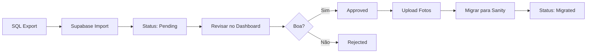

# 🚀 Guia de Implementação - WordPress Catalog System

## ✅ O Que Foi Implementado

### 1. **Schema SQL** (`sql/wordpress_catalog_schema.sql`)
- ✅ Tabelas: `wordpress_properties`, `wordpress_migration_tasks`
- ✅ Full-text search em português (títulos, descrições, localização)
- ✅ RLS (Row Level Security) habilitado
- ✅ Triggers automáticos (updated_at, search_vector)
- ✅ View de estatísticas (`wordpress_catalog_stats`)

### 2. **Service Layer** (`lib/services/wordpress-catalog-service.ts`)
- ✅ Import SQL → Supabase
- ✅ Upload de fotos → Supabase Storage
- ✅ Workflow de aprovação (pending → reviewing → approved → migrated)
- ✅ Migração seletiva → Sanity

### 3. **UI Components**
- ✅ `components/ui/tabs.tsx` - Tabs component customizado
- ✅ `app/dashboard/wordpress-catalog/page.tsx` - UI completa

### 4. **UI/UX Features**
- ✅ Grid responsivo com Framer Motion animations
- ✅ Search full-text + filtros por status
- ✅ Stats cards animados
- ✅ Modal de detalhes com 3 tabs (Detalhes, Fotos, Ações)
- ✅ Workflow buttons dinâmicos por status
- ✅ TanStack Query para cache inteligente
- ✅ Skeleton loaders durante carregamento
- ✅ Empty states quando não há dados

---

## 📋 Próximos Passos para Implementação

### **Passo 1: Executar Schema SQL no Supabase** 🔴 CRÍTICO

```bash
# 1. Copie o conteúdo do arquivo
cat /home/jpcardozx/projetos/nova-ipe/sql/wordpress_catalog_schema.sql

# 2. Acesse Supabase Dashboard
# https://app.supabase.com → Seu Projeto → SQL Editor

# 3. Cole o SQL completo e clique em "Run" ou Ctrl+Enter
```

**Validar criação:**
```sql
-- Verificar tabelas
SELECT table_name FROM information_schema.tables 
WHERE table_schema = 'public' 
AND table_name LIKE 'wordpress%';

-- Deve retornar:
-- wordpress_properties
-- wordpress_migration_tasks

-- Verificar view
SELECT * FROM wordpress_catalog_stats;
-- Deve retornar 1 linha com zeros (ainda sem dados)
```

---

### **Passo 2: Testar a UI (Vazia)**

```bash
cd /home/jpcardozx/projetos/nova-ipe

# Iniciar dev server
npm run dev

# Acessar
# http://localhost:3000/dashboard/wordpress-catalog
```

**O que você verá:**
- ✅ Header com logo animado
- ✅ Stats vazios (0 total, 0 prontas)
- ✅ Mensagem "Nenhuma ficha encontrada"

**Isso é NORMAL** porque ainda não importamos os dados!

---

### **Passo 3: Importar 761 Fichas para Supabase** 🟡

Agora vamos importar as 761 properties do SQL para o Supabase (NÃO para Sanity ainda):

```bash
# 1. Tornar o script executável
chmod +x scripts/import-to-supabase-correct.ts

# 2. Executar import
npx tsx scripts/import-to-supabase-correct.ts
```

**O que acontece:**
1. ✅ Lê o SQL export (11.4 MB)
2. ✅ Extrai as 761 properties
3. ✅ Insere no Supabase `wordpress_properties`
4. ✅ Status inicial: `pending`
5. ✅ Cria search_vector para busca full-text

**Output esperado:**
```
🚀 WordPress → Supabase Import

══════════════════════════════════════════════════

📖 Lendo arquivo SQL...
✓ Arquivo carregado (11.42 MB)

🔍 Extraindo properties do SQL...
✓ 761 properties encontradas

📤 Importando para Supabase...
──────────────────────────────────────────────────
⏳ Progresso: 761/761 (100.0%)

✅ Import concluído!
   • Total processado: 761/761
   • Duplicatas ignoradas: 0

📊 Próximos passos:
   1. Acesse http://localhost:3000/dashboard/wordpress-catalog
   2. Revise as fichas e aprove as melhores
   3. Upload de fotos será implementado em seguida
```

---

### **Passo 4: Revisar Fichas no Dashboard** 🟢

Agora a UI terá dados reais:

```
http://localhost:3000/dashboard/wordpress-catalog
```

**Fluxo de Revisão:**

1. **Ver todas as fichas** (761 pending)
   - Grid com cards animados
   - Search: busque por "casa", "apartamento", "cobertura"
   - Pagination: 30 por página

2. **Clicar em uma ficha** → Abre modal com 3 tabs:
   - **Detalhes**: descrição, dormitórios, banheiros, área, preço
   - **Fotos**: (vazio ainda - fotos não foram uploaded)
   - **Ações**: botões de workflow

3. **Iniciar revisão:**
   - Clique "Iniciar Revisão"
   - Status muda: `pending` → `reviewing`
   - Adicione notas (opcional)

4. **Aprovar ou rejeitar:**
   - **Aprovar**: ficha boa, vai para `approved` (pronta para migrar)
   - **Rejeitar**: ficha ruim, vai para `rejected`

5. **Visualizar por status:**
   - Clique nos pills no topo:
     - 🟡 Pending (aguardando revisão)
     - 🔵 Reviewing (em análise)
     - 🟢 Approved (prontas para Sanity)
     - ⚫ Migrated (já no Sanity)
     - 🔴 Rejected (descartadas)

---

### **Passo 5: Upload de Fotos do Lightsail para Supabase** 🟡

As fotos estão no Lightsail. Precisamos:
1. Baixar do Lightsail
2. Upload para Supabase Storage
3. Atualizar `photo_urls` na tabela

**Opção A: Manual (rsync + UI upload)**
```bash
# 1. Baixar todas as fotos do WPL
rsync -avz --progress \
  bitnami@13.223.237.99:/opt/bitnami/wordpress/wp-content/uploads/WPL/ \
  ./temp/wpl-photos/

# 2. Upload via Supabase Dashboard:
# Storage → documents → Create folder: wordpress-photos
# Para cada wp_id, criar pasta e upload manual
```

**Opção B: Script Automatizado** (RECOMENDADO)

Criar script que:
1. Para cada property com `pic_numb > 0`
2. Baixa `img_foto01.jpg` até `img_foto{pic_numb}.jpg`
3. Upload via `WordPressCatalogService.uploadPropertyPhotos()`
4. Atualiza `photo_urls[]` e `thumbnail_url`

```bash
# Criar script futuro:
npx tsx scripts/upload-photos-to-supabase.ts
```

---

### **Passo 6: Migrar Fichas Aprovadas para Sanity** 🟢

Depois de:
- ✅ Fichas revisadas
- ✅ Melhores aprovadas (`approved` status)
- ✅ Fotos uploaded

Agora pode migrar para Sanity:

**No Dashboard:**
1. Filtrar por "Approved"
2. Clicar em uma ficha
3. Tab "Ações" → "Migrar para Sanity"
4. Aguardar progresso (download + upload)
5. Status muda: `approved` → `migrated`
6. `sanity_id` preenchido

**Isso cria:**
- ✅ Documento `imovel` no Sanity
- ✅ Imagens no Sanity Assets
- ✅ Referências corretas
- ✅ Slug único

---

## 🎯 Resumo do Workflow



---

## 📊 Vantagens Dessa Abordagem

### 1. **Economia de Custos** 💰
- **Antes**: 4GB no Sanity = ~$40-80/mês
- **Agora**: 4GB no Cloudflare R2 = **~$0.06/mês** + Zero egress!
- **Economia**: ~**99.85%** ($40-80/mês economizados!) 🎉

### 2. **Controle de Qualidade** ✅
- Revisão manual antes de publicar
- Rejeita fichas ruins
- Notas de revisão para histórico

### 3. **Performance** ⚡
- Search full-text em PostgreSQL (rápido!)
- TanStack Query com cache inteligente
- Pagination eficiente

### 4. **UX Profissional** 🎨
- Framer Motion animations
- Loading states
- Empty states
- Toast notifications
- Modal com tabs

---

## 🐛 Troubleshooting

### Erro: "Tabela wordpress_properties não existe"
```bash
# Solução: Execute o schema SQL no Supabase
# Ver Passo 1 deste guia
```

### Erro: "Failed to fetch"
```bash
# Verifique env vars:
echo $NEXT_PUBLIC_SUPABASE_URL
echo $NEXT_PUBLIC_SUPABASE_ANON_KEY

# Se vazios, adicione no .env.local:
NEXT_PUBLIC_SUPABASE_URL=https://seu-projeto.supabase.co
NEXT_PUBLIC_SUPABASE_ANON_KEY=sua-anon-key
```

### Stats aparecem zeros mesmo após import
```bash
# Verifique se dados foram inseridos:
# Supabase Dashboard → Table Editor → wordpress_properties
# Deve ter 761 linhas

# Se não, re-execute import:
npx tsx scripts/import-to-supabase-correct.ts
```

### Modal não abre
```bash
# Verifique se tem erros no console do navegador
# F12 → Console

# Erro comum: "queryClient is undefined"
# Solução: Verifique se <QueryClientProvider> está em layout.tsx
```

---

## 📝 Checklist de Implementação

- [ ] **Passo 1**: Executar schema SQL no Supabase
- [ ] **Passo 2**: Testar UI vazia
- [ ] **Passo 3**: Importar 761 fichas
- [ ] **Passo 4**: Revisar e aprovar melhores fichas
- [ ] **Passo 5**: Upload de fotos (manual ou script)
- [ ] **Passo 6**: Migrar fichas aprovadas para Sanity

---

## 🚀 Próximas Melhorias

### Curto Prazo
- [ ] Script automatizado de upload de fotos
- [ ] Bulk actions (aprovar múltiplas de uma vez)
- [ ] Filtros avançados (por tipo, preço, localização)

### Médio Prazo
- [ ] AI para descrições melhores
- [ ] Auto-categorização de imóveis
- [ ] Sugestão de preços baseada em mercado

### Longo Prazo
- [ ] Sync bidirecional WordPress ↔ Supabase
- [ ] API pública para integrações
- [ ] Dashboard analytics avançado

---

## 💬 Suporte

Em caso de dúvidas ou problemas:
1. Verifique este guia primeiro
2. Leia `docs/WORDPRESS_CATALOG_OPTIMIZED_SOLUTION.md`
3. Veja os comentários em `lib/services/wordpress-catalog-service.ts`

**Arquivos importantes:**
- Service: `lib/services/wordpress-catalog-service.ts`
- Schema: `sql/wordpress_catalog_schema.sql`
- UI: `app/dashboard/wordpress-catalog/page.tsx`
- Docs: `docs/WORDPRESS_CATALOG_OPTIMIZED_SOLUTION.md`
