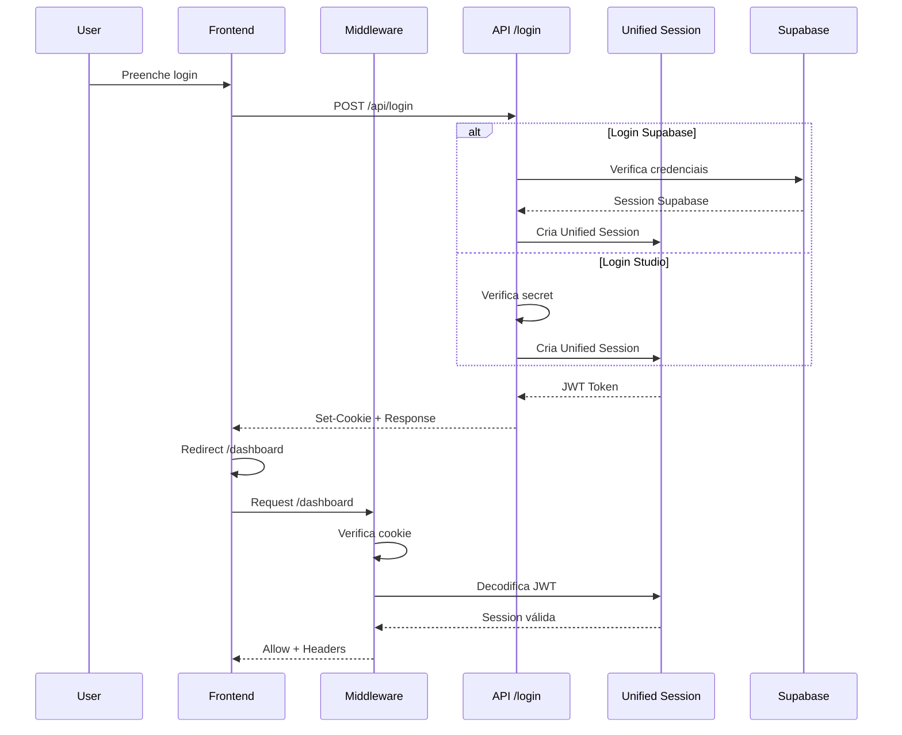

# 🔐 Sistema de Autenticação Unificado - Nova IPE

## 📋 Visão Geral

Sistema profissional de autenticação que orquestra **Supabase** e **Sanity Studio** em uma única sessão unificada, eliminando conflitos de cookies e problemas de sincronização.

## 🎯 Problema Resolvido

### Antes (Contraproducente)
```
❌ POST /login 200 (sucesso)
❌ Middleware: authenticated: false (CONFLITO!)
❌ Múltiplos cookies: sb-*-auth-token, admin-auth, studio-mode
❌ Sessões desincronizadas
```

### Depois (Orquestrado)
```
✅ POST /login 200 (sucesso)
✅ Middleware: authenticated: true (CONSISTENTE!)
✅ Cookie único: nova-ipe-unified-session
✅ Sessão sincronizada Supabase + Studio
```

## 🏗️ Arquitetura

### Stack Tecnológica
- **@supabase/ssr** → Cliente SSR-ready para Next.js 15
- **jose** → JWT moderno (substitui jsonwebtoken)
- **iron-session** → Sessões seguras criptografadas
- **zod** → Validação de schemas
- **@auth/core** → Integração Auth.js (futuro)

### Componentes

#### 1. Unified Session Manager (`lib/auth/unified-session.ts`)
Orquestra todas as operações de autenticação:

```typescript
// Login Supabase
const result = await loginWithSupabase(email, password)

// Login Studio
const result = await loginWithStudio(secret)

// Verificar sessão
const session = await getCurrentUser()

// Logout universal
await logout()
```

#### 2. Middleware Inteligente (`middleware.ts`)
Verifica autenticação no edge com fallback automático:

```typescript
// 1. Verifica unified session
// 2. Se não existe, tenta migrar do Supabase
// 3. Adiciona headers de sessão para APIs
// 4. Controla permissões por role
```

#### 3. APIs Unificadas

##### POST /api/login
```typescript
// Supabase
POST /api/login
{
  "email": "user@example.com",
  "password": "secret"
}

// Studio
POST /api/login?mode=studio
{
  "senha": "studio-secret"
}
```

##### GET /api/studio/session
```typescript
GET /api/studio/session
Response: {
  "authenticated": true,
  "user": {
    "userId": "...",
    "email": "...",
    "role": "studio",
    "provider": "sanity"
  }
}
```

##### DELETE /api/login (Logout)
```typescript
DELETE /api/login
Response: { "success": true }
```

## 🎨 Schema da Sessão Unificada

```typescript
interface UnifiedSession {
  userId: string
  email: string
  provider: 'supabase' | 'sanity' | 'admin'
  role: 'user' | 'admin' | 'studio'
  expiresAt: number
  metadata?: {
    supabase?: {
      accessToken: string
      refreshToken: string
    }
    studioAccess?: boolean
  }
}
```

## 🚀 Como Usar

### 1. Login Frontend (Supabase)
```typescript
const response = await fetch('/api/login', {
  method: 'POST',
  headers: { 'Content-Type': 'application/json' },
  body: JSON.stringify({
    email: 'user@example.com',
    password: 'password123'
  })
})

const data = await response.json()
if (data.success) {
  // Sessão criada automaticamente
  window.location.href = '/dashboard'
}
```

### 2. Login Frontend (Studio)
```typescript
const response = await fetch('/api/login?mode=studio', {
  method: 'POST',
  headers: { 'Content-Type': 'application/json' },
  body: JSON.stringify({
    senha: 'studio-secret'
  })
})

const data = await response.json()
if (data.success) {
  window.location.href = '/studio'
}
```

### 3. Verificar Sessão (Server Component)
```typescript
import { getCurrentUser } from '@/lib/auth/unified-session'

export default async function DashboardPage() {
  const session = await getCurrentUser()
  
  if (!session) {
    redirect('/login')
  }

  return <div>Bem-vindo, {session.email}</div>
}
```

### 4. Verificar Permissões
```typescript
import { checkPermission } from '@/lib/auth/unified-session'

export default async function StudioPage() {
  const hasAccess = await checkPermission('studio')
  
  if (!hasAccess) {
    redirect('/login?mode=studio')
  }

  return <StudioInterface />
}
```

### 5. Logout
```typescript
const handleLogout = async () => {
  await fetch('/api/login', { method: 'DELETE' })
  window.location.href = '/login'
}
```

## 🔒 Segurança

### Features
- ✅ **JWT seguro** com jose (HS256)
- ✅ **Cookies httpOnly** (não acessíveis via JS)
- ✅ **SameSite Lax** (proteção CSRF)
- ✅ **Secure flag** em produção
- ✅ **Validação Zod** em todos os inputs
- ✅ **Expiração automática** (12h)
- ✅ **Secret key** via env vars

### Variáveis de Ambiente Requeridas
```bash
# Supabase
NEXT_PUBLIC_SUPABASE_URL=https://xxx.supabase.co
NEXT_PUBLIC_SUPABASE_ANON_KEY=eyJ...

# JWT (gerar com: openssl rand -base64 32)
JWT_SECRET=your-super-secret-jwt-key-change-in-production

# Studio
SANITY_STUDIO_ADMIN_SECRET=your-studio-secret
```

## 📊 Fluxo de Autenticação



## 🔄 Migração Automática

O middleware migra automaticamente sessões Supabase antigas:

```typescript
// Detecta cookie sb-*-auth-token (legado)
// ↓
// Verifica sessão no Supabase
// ↓
// Cria unified session
// ↓
// Próximas requisições usam unified session
```

## 🧪 Testes

### Teste de Login Supabase
```bash
curl -X POST http://localhost:3000/api/login \
  -H "Content-Type: application/json" \
  -d '{
    "email": "test@example.com",
    "password": "password123"
  }'
```

### Teste de Login Studio
```bash
curl -X POST "http://localhost:3000/api/login?mode=studio" \
  -H "Content-Type: application/json" \
  -d '{
    "senha": "studio-secret"
  }'
```

### Teste de Sessão
```bash
curl -X GET http://localhost:3000/api/studio/session \
  --cookie "nova-ipe-unified-session=..."
```

## 📈 Logs de Debugging

### Desenvolvimento
```typescript
// middleware.ts
✅ [Middleware] Authorized: user@example.com (user)

// login route
✅ [Supabase Login] Success: user@example.com
✅ [Studio Login] Success

// session route
✅ Sessão Studio ativa: admin@nova-ipe.com.br
```

## 🎯 Benefícios

1. **Cookie Único** → Elimina conflitos
2. **Migração Automática** → Backward compatible
3. **Type-Safe** → TypeScript + Zod
4. **SSR-Ready** → @supabase/ssr
5. **Edge Compatible** → Funciona no middleware
6. **Role-Based** → Controle granular de permissões
7. **Open Source** → Libs modernas e mantidas

## 🚦 Status

| Feature | Status |
|---------|--------|
| Login Supabase | ✅ Implementado |
| Login Studio | ✅ Implementado |
| Middleware Unificado | ✅ Implementado |
| Migração Automática | ✅ Implementado |
| Logout Universal | ✅ Implementado |
| Role-Based Auth | ✅ Implementado |
| Type Safety | ✅ Implementado |
| SSR Support | ✅ Implementado |

## 📚 Referências

- [Supabase SSR](https://supabase.com/docs/guides/auth/server-side)
- [jose (JWT)](https://github.com/panva/jose)
- [iron-session](https://github.com/vvo/iron-session)
- [Zod](https://zod.dev/)
- [Next.js 15 Middleware](https://nextjs.org/docs/app/building-your-application/routing/middleware)

---

**Criado em:** 12/10/2025  
**Stack:** Next.js 15 + Supabase + Sanity + TypeScript
