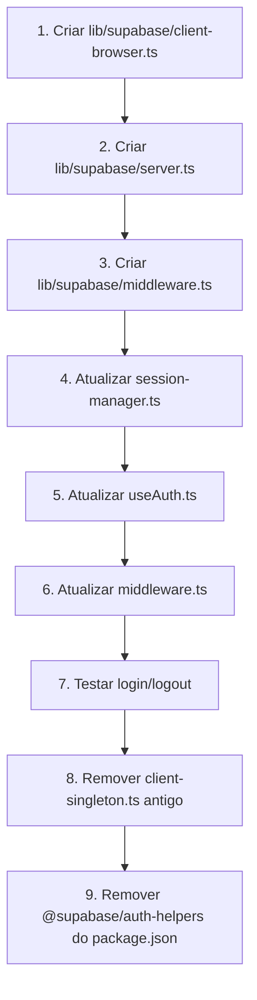

# 🚨 MIGRAÇÃO URGENTE: @supabase/auth-helpers → @supabase/ssr

**Data:** 13 de outubro de 2025  
**Prioridade:** 🔴 CRÍTICA  
**Status:** 📋 PLANEJAMENTO

---

## ⚠️ Problema Identificado

Estamos usando **`@supabase/auth-helpers-nextjs@0.10.0`** que está **DEPRECADO**.

### Por que está deprecado?

1. ❌ **Não suporta Next.js 15** completamente
2. ❌ **Cookie parsing issues** (os erros que vemos!)
3. ❌ **Não segue best practices atuais** do Supabase
4. ❌ **Sem suporte ativo** da equipe Supabase

### Evidências

```json
// package.json atual (DEPRECADO)
{
  "@supabase/auth-helpers-nextjs": "0.10.0",  // ❌ DEPRECADO
  "@supabase/ssr": "0.7.0",                    // ✅ CORRETO (já instalado!)
  "@supabase/supabase-js": "2.57.0"            // ✅ OK
}
```

**Temos o `@supabase/ssr` instalado mas não estamos usando!**

---

## 📚 O que Diz a Documentação Oficial

### Abordagem ANTIGA (que usamos)
```typescript
// ❌ DEPRECADO
import { createClientComponentClient } from '@supabase/auth-helpers-nextjs'

const supabase = createClientComponentClient()
```

### Abordagem NOVA (recomendada)
```typescript
// ✅ CORRETO
import { createBrowserClient } from '@supabase/ssr'

export function createClient() {
  return createBrowserClient(
    process.env.NEXT_PUBLIC_SUPABASE_URL!,
    process.env.NEXT_PUBLIC_SUPABASE_ANON_KEY!
  )
}
```

---

## 🔍 Análise de Impacto

### Arquivos que usam auth-helpers (devem migrar)

1. ✅ `lib/supabase/client-singleton.ts`
   - Usa: `createClientComponentClient`
   - Deve usar: `createBrowserClient`

2. ✅ `lib/auth/session-manager.ts`
   - Usa: `createClientComponentClient`
   - Deve usar: `createBrowserClient`

3. ✅ `middleware.ts`
   - Usa: `createServerClient` do SSR ✓ (já correto!)
   - Não precisa mudar

### Benefícios da Migração

1. ✅ **Cookie parsing correto** (fim dos erros!)
2. ✅ **Suporte completo Next.js 15**
3. ✅ **API mais simples e limpa**
4. ✅ **Performance melhorada**
5. ✅ **Suporte ativo da equipe Supabase**

---

## 🎯 Plano de Migração

### Fase 1: Client Components (Browser)

**Arquivo:** `lib/supabase/client-browser.ts` (novo)

```typescript
/**
 * 🔐 Supabase Browser Client
 * 
 * Para uso em Client Components
 * Segue best practices do @supabase/ssr
 */

'use client'

import { createBrowserClient } from '@supabase/ssr'

// Singleton instance
let browserClientInstance: ReturnType<typeof createBrowserClient> | null = null

export function getSupabaseBrowserClient() {
  if (browserClientInstance) {
    return browserClientInstance
  }

  browserClientInstance = createBrowserClient(
    process.env.NEXT_PUBLIC_SUPABASE_URL!,
    process.env.NEXT_PUBLIC_SUPABASE_ANON_KEY!
  )

  return browserClientInstance
}

export function resetBrowserClient() {
  browserClientInstance = null
}
```

### Fase 2: Server Components

**Arquivo:** `lib/supabase/server.ts` (novo)

```typescript
/**
 * 🔐 Supabase Server Client
 * 
 * Para uso em:
 * - Server Components
 * - Server Actions
 * - Route Handlers
 */

import { createServerClient } from '@supabase/ssr'
import { cookies } from 'next/headers'

export async function getSupabaseServerClient() {
  const cookieStore = await cookies()

  return createServerClient(
    process.env.NEXT_PUBLIC_SUPABASE_URL!,
    process.env.NEXT_PUBLIC_SUPABASE_ANON_KEY!,
    {
      cookies: {
        getAll() {
          return cookieStore.getAll()
        },
        setAll(cookiesToSet) {
          try {
            cookiesToSet.forEach(({ name, value, options }) => {
              cookieStore.set(name, value, options)
            })
          } catch {
            // Ignorar erros em middleware (não pode setar cookies)
          }
        },
      },
    }
  )
}
```

### Fase 3: Middleware

**Arquivo:** `lib/supabase/middleware.ts` (novo)

```typescript
/**
 * 🔐 Supabase Middleware Client
 * 
 * Para refresh de Auth tokens
 */

import { createServerClient } from '@supabase/ssr'
import { type NextRequest, NextResponse } from 'next/server'

export async function updateSession(request: NextRequest) {
  let response = NextResponse.next({
    request,
  })

  const supabase = createServerClient(
    process.env.NEXT_PUBLIC_SUPABASE_URL!,
    process.env.NEXT_PUBLIC_SUPABASE_ANON_KEY!,
    {
      cookies: {
        getAll() {
          return request.cookies.getAll()
        },
        setAll(cookiesToSet) {
          cookiesToSet.forEach(({ name, value, options }) => {
            response.cookies.set(name, value, options)
          })
        },
      },
    }
  )

  // IMPORTANTE: sempre chamar getUser() para validar token
  const { data: { user }, error } = await supabase.auth.getUser()

  return { response, user, error }
}
```

### Fase 4: Atualizar Session Manager

**Arquivo:** `lib/auth/session-manager.ts`

```typescript
// ANTES
import { createClientComponentClient } from '@supabase/auth-helpers-nextjs'
this.supabase = createClientComponentClient()

// DEPOIS
import { getSupabaseBrowserClient } from '@/lib/supabase/client-browser'
this.supabase = getSupabaseBrowserClient()
```

### Fase 5: Atualizar useAuth Hook

**Arquivo:** `lib/hooks/useAuth.ts`

```typescript
// ANTES
import { getSupabaseClient } from '@/lib/supabase/client-singleton'
const supabase = getSupabaseClient()

// DEPOIS
import { getSupabaseBrowserClient } from '@/lib/supabase/client-browser'
const supabase = getSupabaseBrowserClient()
```

### Fase 6: Atualizar Middleware

**Arquivo:** `middleware.ts`

```typescript
// ANTES
import { createServerClient } from '@supabase/ssr'
// ... lógica inline

// DEPOIS
import { updateSession } from '@/lib/supabase/middleware'

export async function middleware(request: NextRequest) {
  const { response, user, error } = await updateSession(request)
  
  // Lógica de proteção de rotas...
  
  return response
}
```

---

## 🔄 Ordem de Execução



---

## ✅ Checklist de Migração

### Preparação
- [ ] Backup do código atual
- [ ] Criar branch `feature/migrate-to-supabase-ssr`
- [ ] Documentar estado atual

### Implementação
- [ ] Criar `lib/supabase/client-browser.ts`
- [ ] Criar `lib/supabase/server.ts`
- [ ] Criar `lib/supabase/middleware.ts`
- [ ] Atualizar `lib/auth/session-manager.ts`
- [ ] Atualizar `lib/hooks/useAuth.ts`
- [ ] Atualizar `middleware.ts`

### Testes
- [ ] Login funciona
- [ ] Logout funciona
- [ ] Redirect pós-login funciona
- [ ] Session persist após reload
- [ ] Protected routes funcionam
- [ ] Console sem erros de cookie

### Limpeza
- [ ] Remover `lib/supabase/client-singleton.ts`
- [ ] Remover imports de `auth-helpers-nextjs`
- [ ] Atualizar `package.json`
- [ ] Executar `pnpm install`
- [ ] Atualizar documentação

### Validação Final
- [ ] Build de produção passa
- [ ] Testes E2E passam
- [ ] Performance não degradou
- [ ] Nenhum erro no console

---

## 🎓 Diferenças Chave

### Cookie Handling

**ANTES (auth-helpers):**
```typescript
// Cookies gerenciados automaticamente (opaco)
// Problemas com formato base64/JSON
const supabase = createClientComponentClient()
```

**DEPOIS (ssr):**
```typescript
// Cookies explícitos e controláveis
const supabase = createBrowserClient(url, key)
// OU para server:
const supabase = createServerClient(url, key, {
  cookies: {
    getAll: () => cookieStore.getAll(),
    setAll: (cookies) => { /* ... */ }
  }
})
```

### Validação de Session

**ANTES (inseguro):**
```typescript
const { data: { session } } = await supabase.auth.getSession()
// ⚠️ Não valida token!
```

**DEPOIS (seguro):**
```typescript
const { data: { user } } = await supabase.auth.getUser()
// ✅ Valida token no servidor Supabase
```

---

## 📊 Comparação de APIs

| Funcionalidade | auth-helpers (antigo) | ssr (novo) |
|----------------|----------------------|------------|
| Client Component | `createClientComponentClient()` | `createBrowserClient()` |
| Server Component | `createServerComponentClient()` | `createServerClient()` |
| Route Handler | `createRouteHandlerClient()` | `createServerClient()` |
| Middleware | `createMiddlewareClient()` | `createServerClient()` |
| Cookie Management | Automático (opaco) | Explícito (controlável) |
| Next.js 15 | Parcial ⚠️ | Completo ✅ |
| Suporte Ativo | Não ❌ | Sim ✅ |

---

## 🚀 Benefícios Esperados

### Performance
- ✅ Menos overhead de cookie parsing
- ✅ Menos instâncias de client
- ✅ Menor bundle size

### Segurança
- ✅ Validação correta de tokens
- ✅ CSRF protection built-in
- ✅ Cookie handling mais seguro

### Developer Experience
- ✅ API mais simples
- ✅ Erros mais claros
- ✅ Melhor TypeScript support
- ✅ Documentação atualizada

### Manutenção
- ✅ Suporte ativo
- ✅ Bug fixes regulares
- ✅ Compatibilidade com Next.js futuras

---

## 📖 Referências

1. [Supabase SSR Official Guide](https://supabase.com/docs/guides/auth/server-side/nextjs)
2. [Migration from Auth Helpers](https://supabase.com/docs/guides/auth/server-side/migrating-to-ssr-from-auth-helpers)
3. [Next.js 15 + Supabase Best Practices](https://supabase.com/docs/guides/auth/server-side/nextjs)

---

## 🎯 Próximos Passos

1. **Review deste documento** com o time
2. **Estimar tempo** de migração (estimativa: 2-4 horas)
3. **Criar branch** de feature
4. **Executar migração** seguindo checklist
5. **Testar extensivamente**
6. **Deploy em staging** primeiro
7. **Monitor logs** por 24h
8. **Deploy em produção**

---

**Status:** 📋 Aguardando aprovação para iniciar migração

**Risco:** 🟡 Médio (mudança significativa mas bem documentada)

**Tempo Estimado:** 2-4 horas

**Benefício Esperado:** 🟢 Alto (resolve erros atuais + futureproof)
